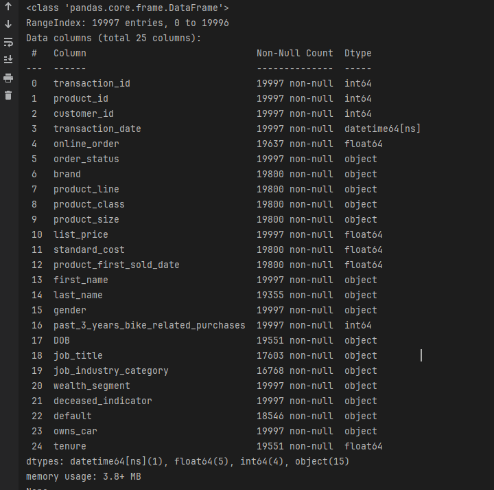
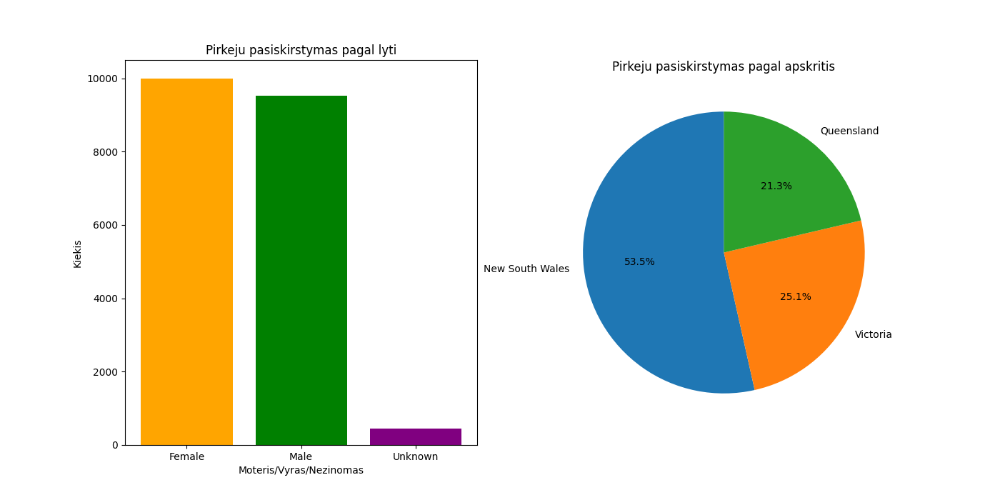
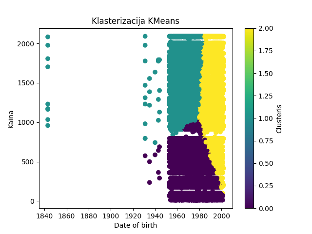
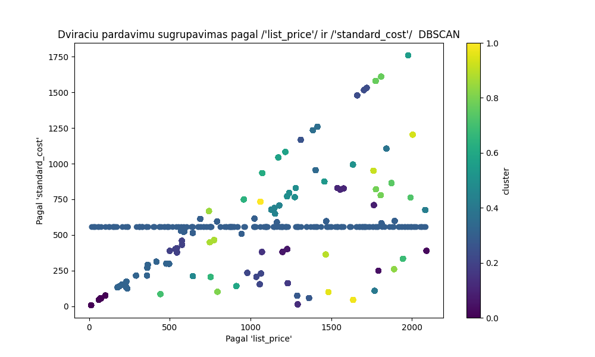
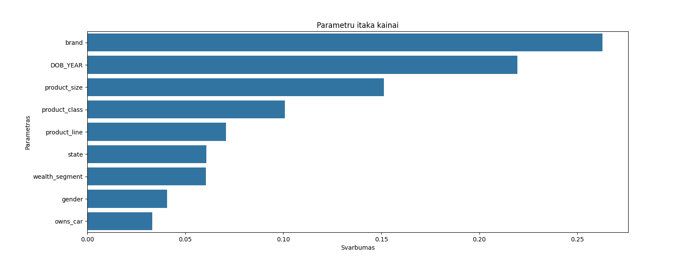
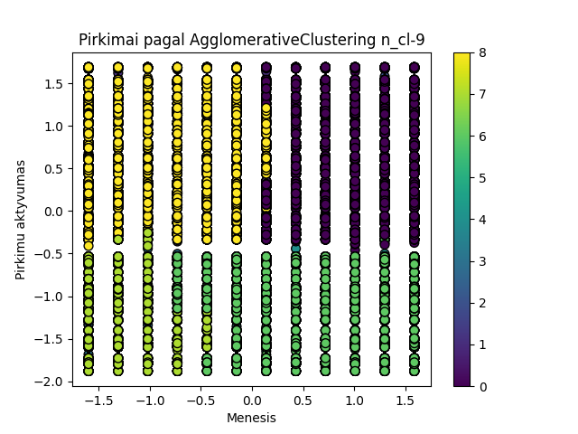

Baigiamasis darbas 2024-05

Baigiamasis darbas (Duomenu mokslas)

Darba atliko : Audrius Janikunas ir Alfredas Motuzas

Darbo tikslas : Isanalizuoti elektronines dviraciu parduotuves vienu metu pardavimo duomenis ir pateikti isvadas

Darbo eiga :

Duomenu parduotuves realus elektronis adresas : ( https://www.99bikes.co.uk/ )

    - duomenu rinkinio analize ir apzvalga naudojant 'PANDAS' :
        * duomenu rinkinio apzvalga

        * visu pardavimu skaicius

        * pardavimu skaicius pagal menesius
\

        * pardavimu skaicius pagal dviraciu tipus

        
        * pardavimus skaicius pagal dviraciu klalses

        
        * sujungiame tris skirtintgus excel sheet (pardavimu ir klientu duomenu pagal kliento_id, gyvenoji vieta),
        kada galetume analizuoti duomenis pagal daugiau parametru

 (REIKES PAKEISTI I 3 SHEET)
     
 

       
        * pirkimų skaičius pagal lytį skaiciavimas

        * pirkimu skaicius pagal lyti ir pagal apskritis grafikas

        * apskriciu zemelapis

        

     - duomenu rinkinio analaize naudojant masininio mokymo metodus:

        * Kmeans

        * DBscan (dar tikslinti jei bus laiko)

        * RandomForest

        * AgglomerativeClustering

        
        - ROC AUC

        -Elbow

     - duomenu rinkinio analize naudojant neuroninius tinklus:

        *
        *
        *

Išvados, komentarai/pasi?lymai, sunkumai su kuriais teko susidurti:

