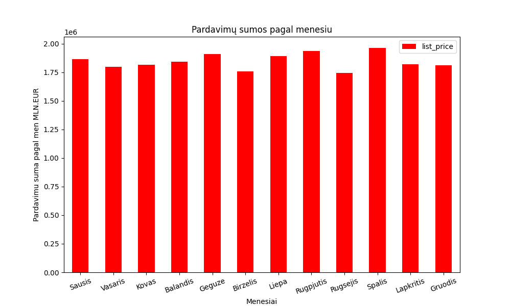
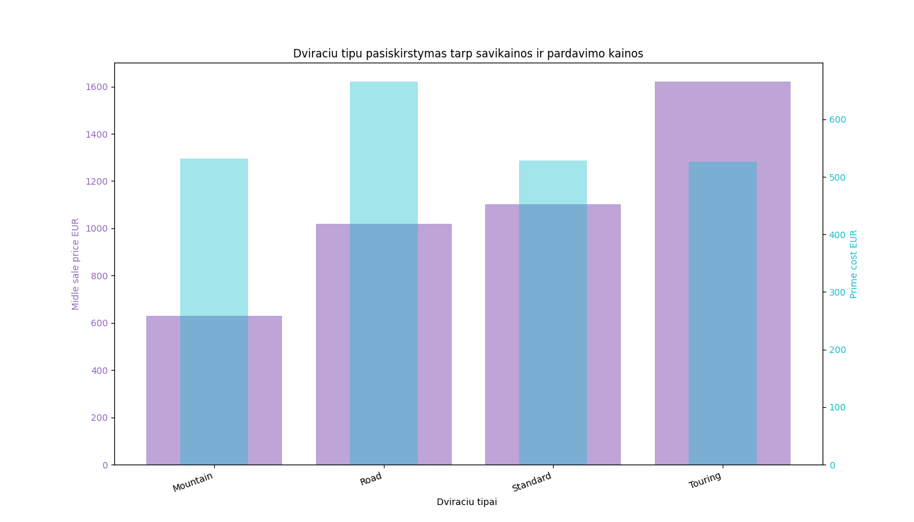
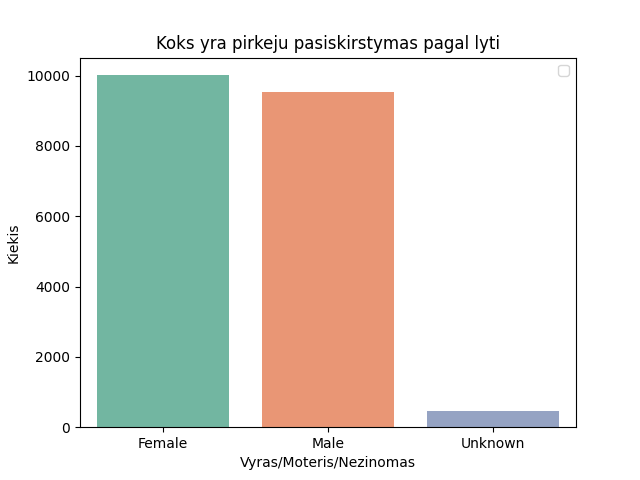

Baigiamasis darbas 2024-05

Baigiamasis darbas (Duomenu mokslas)

Darba atliko : Audrius Janikunas ir Alfredas Motuzas

Darbo tikslas : Isanalizuoti elektronines dviraciu parduotuves vienu metu pardavimo duomenis ir pateikti isvadas

Darbo eiga :

Duomenu parduotuves realus elektronis adresas : ( https://www.99bikes.co.uk/ )

    - duomenu rinkinio analize ir apzvalga naudojant 'PANDAS' :
        * duomenu rinkinio apzvalga

        * visu pardavimu skaicius

        * pardavimu skaicius pagal menesius
        
        * pardavimu skaicius pagal dviraciu tipus

        
        * pardavimus skaicius pagal dviraciu klalses

        
        * sujungiame du skirtintgus excel sheet (pardavimu ir klientu duomenu pagal kliento_id),
        kada galetume analizuoti duomenis pagal daugiau parametru
<class 'pandas.core.frame.DataFrame'>
RangeIndex: 19997 entries, 0 to 19996
Data columns (total 25 columns):
 #   Column                               Non-Null Count  Dtype         
---  ------                               --------------  -----         
 0   transaction_id                       19997 non-null  int64         
 1   product_id                           19997 non-null  int64         
 2   customer_id                          19997 non-null  int64         
 3   transaction_date                     19997 non-null  datetime64[ns]
 4   online_order                         19637 non-null  float64       
 5   order_status                         19997 non-null  object        
 6   brand                                19800 non-null  object        
 7   product_line                         19800 non-null  object        
 8   product_class                        19800 non-null  object        
 9   product_size                         19800 non-null  object        
 10  list_price                           19997 non-null  float64       
 11  standard_cost                        19800 non-null  float64       
 12  product_first_sold_date              19800 non-null  float64       
 13  first_name                           19997 non-null  object        
 14  last_name                            19355 non-null  object        
 15  gender                               19997 non-null  object        
 16  past_3_years_bike_related_purchases  19997 non-null  int64         
 17  DOB                                  19551 non-null  object        
 18  job_title                            17603 non-null  object        
 19  job_industry_category                16768 non-null  object        
 20  wealth_segment                       19997 non-null  object        
 21  deceased_indicator                   19997 non-null  object        
 22  default                              18546 non-null  object        
 23  owns_car                             19997 non-null  object        
 24  tenure                               19551 non-null  float64       
dtypes: datetime64[ns](1), float64(5), int64(4), object(15)
memory usage: 3.8+ MB

       
        * pirkimų skaičius pagal lytį

        

     - duomenu rinkinio analaize naudojant masininio mokymo metodus:

        * Kmeans
        * DBscan
        * RandomForest
        * KNeighbour
        
        - ROC AUC
        -Elbow

     - duomenu rinkinio analize naudojant neuroninius tinklus:

        *
        *
        *

Išvados, komentarai/pasi?lymai, sunkumai su kuriais teko susidurti:

