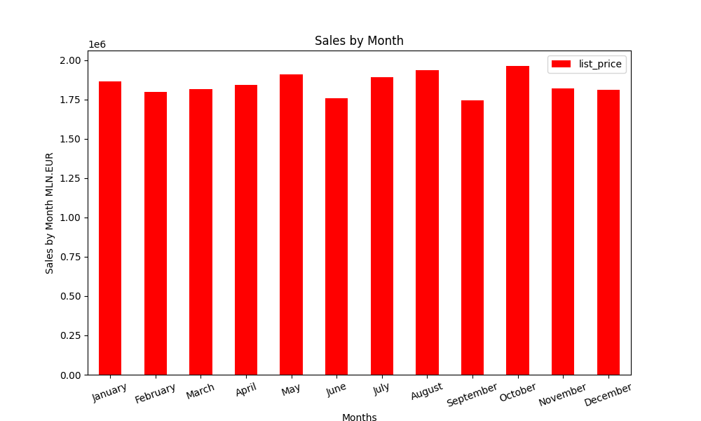

Baigiamasis darbas 2024-05

Baigiamasis darbas (Duomenų mokslas)

Darba atliko : Audrius Janikūnas ir Alfredas Motuzas

Darbo tikslas : Išanalizuoti elektroninės dviračių parduotuvės vienų metų pardavimo duomenis ir pateikti išvadas,
                bei prognozes.

Darbo eiga :

Parduotuvės realus elektroninis adresas : ( https://www.99bikes.com.au/ )

    - duomenų rinkinio analizė ir apžvalga naudojant 'PANDAS' :
        * duomenų rinkinio apžvalga

        * visu pardavimu skaičius ir vidutinė kaina pagal dviračių tipą (Kalnų, plentinis, hibridas, turistinis)

        * pardavimų skaičius pagal mėnesius (grafikas)

        * pardavimu skaičius pagal dviračiu tipus (grafinis atvaizdavimas)

        
        * pardavimus skaičius pagal dviračiu klases (grafinis atvaizdavimas)

        
        * sujungiame tris skirtingus 'excel sheet' (pardavimų ir klientų duomenų pagal 'kliento_id' ir gyvenamąją vietą
            pagal 'kliento_id'), kad galėtume analizuoti duomenis su daugiau parametrų.

     
       
        * pirkimų skaičius pagal lytį skaiciavimas

        * pirkimu skaičius pagal lytį ir pagal apskritis grafikas

        * apskričių žemėlapis

        * demografija:

     - duomenų rinkinio analizė naudojant mašininio mokymo metodus:

        * Kmeans metodas

        * DBscan metodas taip pat paskaičiuojamas geriausias clusters kiekis pagal Elbow (su keliais bandymais
            gaunamas 2-3 optimalus cl. skaičius)

    *DBSCAN metodui Elbow grafikas

        * RandomForest metodas

        * AgglomerativeClustering metodas

        * LinearRegression metodas

    - MSE, RMSE, R2 (metrikos - 'Mean squared error', 'Root Mean Squared Error', 'R-squared )

        
        - ROC (ROC kreive pagal ONLINE ir fizinius pirkimus)

        * Dviračių kainų palyginimas 2017 metų ir 2024 metų (naudojant 'Scraping' realių kainų surinkimui)

    -Grafinis atvaizdavimas 2017 metų ir 2024 metų

    -Skaičiavimas

     - duomenų rinkinio analizė naudojant neuroninius tinklus:

        * KerasClassifier

    
    Model accuracy: 0.7999
    
    - Modelio tikslumas

    - Modelio nuostoliai

        

    Išvados, komentarai/pasiūlymai, sunkumai su kuriais teko susidurti:

    Išvados:
    
    - Parduotuvės metinė apyvarta - 22 MLN. EUR

    - Kas mėnesį parduodamos produkcijos ~ 2 MLN. EUR

    - Birželį ir rugsėjį pastebimi nežymus pardavimu kritimai (galima butų tais mėnesiais, didinti reklamos apimtis,
        arba taikyti akcijas, kad padidinti pardavimus).

    - Iš grafikų matome, kad didžiausia marža vidutinės klasės dviračių.

    - Vyrų ir moterų dviračiu pirkimas praktiškai 50%/50%.

    - Pasiskirstymas pagal regioną labai akivaizdus, daugiausia nuperkama dviračių kur gyventojų tankumas
        yra didžiausias (Sidnėjus - didžiausias Australijos miestas), o ne didžiausias  teritorijos plotas. 
        (galima būtų plėsti pardavimus į SouthAustralia regioną, logistiškai tinkamoje, taip pat didinti
        reklama Victoria regione ir Queensland regione)

    - Pirkimo pasiskirstymas pagal pirkėjų amžių : matome aiškiai 3 išskirtas grupes, ir kad jaunesni
        žmonės labiau perka brangesnius dviračius.
    
    - Didžiausią įtaką kainai daro : 
                            1- Gamintojas ('brand'),
                            2- Pirkėjo gimimo metai,
                            3- Dviračio dydis,
                            4- Dviračio klasė.

    - Pagal aksesuarų ir dalių pirkimą jaunesni žmonės šiek tiek daugiau atliko pirkimu per 3 metus po
        dviračio pirkimo. (galima pagal metus siūlyti papildomas akcijas aksesuarų ir dalių,
        siuntinėti reklamą)

    - Iš ROC kreives matome kad pagal pirkimus 'ONLINE' ir fizinius  modelio tikslumas artimas 'aklam'
        spėliojimui, ir iš pateiktų (apskaičiuotų) duomenų matome, kad modelis negalėjo apsimokyti, nes
        pirkimai yra ~ 50%/50%.

    - Palyginus Scraping duomenis dviračių tipų 2024m. ir 2017m 'dataset' matome, kad dviračiai stipriai
        pabrango, per 7 metus, bet reikalinga detalesne analizė, nes atsirado labai daug elektrinių
        dviračių, kas labai stipriai įtakoja kainą. Parinkome dviračių tipą kuriame mažiausiai elektrinių
        dviračių segmente, ir 2017 m. 2024 m. kainų kilimas tiksliausias. (Matoma, kad vienodo tipo
        dviračių kainų kilimas rinkoje ~ 10%)
    
    Komentarai / pasiūlymai:

    - Darbo metu labai svarbu planuotis laika, nes vien duomenų valymui galima sugaišti visą savaitę
        (siekiant idealumo), turint ribotą laiką galima tvarkytis tik tuos duomenis su kuriais dirbama.
        
    Sunkumai:
    - Su neuroniniais tinklais dar reikėtų pagilinti žinias, sugaišome daugiausia laiko, bet rezultatais  nesame labai
        patenkinti.

        TIKRAI YRA KUR TOBULĖTI...

    AČIŪ UŽ DĖMESĮ...

    
    
    

