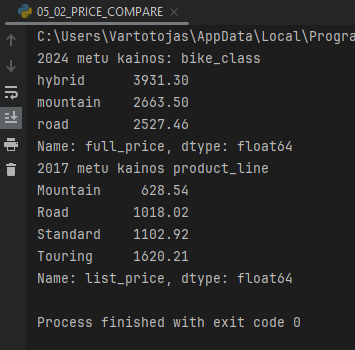

Baigiamasis darbas 2024-05

Baigiamasis darbas (Duomenu mokslas)

Darba atliko : Audrius Janikunas ir Alfredas Motuzas

Darbo tikslas : Isanalizuoti elektronines dviraciu parduotuves vienu metu pardavimo duomenis ir pateikti isvadas

Darbo eiga :

Duomenu parduotuves realus elektronis adresas : ( https://www.99bikes.co.uk/ )

    - duomenu rinkinio analize ir apzvalga naudojant 'PANDAS' :
        * duomenu rinkinio apzvalga

        * visu pardavimu skaicius ir vidutine kaina pagal dviraciu tipa (Kalnu, plentinis, hibridas, turistinis)

        * pardavimu skaicius pagal menesius (grafikas)

        * pardavimu skaicius pagal dviraciu tipus (grafinis atvaizdavimas)

        
        * pardavimus skaicius pagal dviraciu klalses (grafinis atvaizdavimas)

        
        * sujungiame tris skirtintgus excel sheet (pardavimu ir klientu duomenu pagal kliento_id, gyvenoji vieta),
        kada galetume analizuoti duomenis pagal daugiau parametru

     
 
       
        * pirkimų skaičius pagal lytį skaiciavimas

        * pirkimu skaicius pagal lyti ir pagal apskritis grafikas

        * apskriciu zemelapis

        

     - duomenu rinkinio analaize naudojant masininio mokymo metodus:

        * Kmeans

        * DBscan taip pat paskaiciuojamas geriausias clusters kiekis pagal Elbow (su keliais bandymais gaunamas 1-2 optimalus skaicius)

    *DBSCAN metodui Elbow grafikas

        * RandomForest

        * AgglomerativeClustering

        * LinearRegression

    - MSE, RMSE, R2 (metrikos - 'Mean squared error', 'Root Mean Squared Error', 'R-squared )

        
        - ROC (ROC kreive pagal ONLINE ir fizinius pirkimus)

        * Dviraciu kainu palyginimas 2017 metu ir 2024 metu (naudojant Scraping realiu kainu surinkimui)

     - duomenu rinkinio analize naudojant neuroninius tinklus:

        * KerasClassifier

    
    Model accuracy: 0.8027

    -

        

    Išvados, komentarai/pasiulymai, sunkumai su kuriais teko susidurti:

    Išvados:
    
    - Parduotyves metine apyvarta - 22 MLN. EUR
    - Kas menesi parduodamos produkcijos ~ 2 MLN. EUR
    - Birzeli ir rugseji pastebimi nezymus pardavimu kritimai.
    - Iš grafikų matome kad didziausia marža vidutinės klasės dviračiu.
    - Vyrų ir moterų dviračiu pirkimas praktiškai 50/50.
    - Pasiskirstymas pagal regiona labai akivaizdus, kad daugiausia nuperkama dviraciu kur gyventoju tankumas,
        yra didziausias, o ne didziausias plotas teritorijos.
    - Pirkimo pasiskirstymas pagal pirkeju metus : matome aiskiai 3 isskirtas grupes, ir kad jaunesni zmones perka
        brangesnius dviracius labiau. 
    - Didziausia itaka kainai daro : 
                            1- Gamintojas,
                            2- Pirkejo gimimo metai,
                            3- Dviracio dydis
                            4- Dviracio klase

    - Pagal aksesuaru ir daliu pirkima jaunesni zmones siek tiek daugiau atliko pirkimu per 3 metus po
        dviracio pirkimo.
    - Is ROC kreives matome kad pagal pirkimus 'ONLINE' ir fizinius  modelio tikslumas artimas 'aklam'
        speliojimui, ir is pateiktu duomenu matome, kad modelis negalejo apsimokyti nes pirkimai yra ~ 50/50.
    - Palyginus Scraping duomenis dviraciu tipų 2024m. ir 2017m 'dataset', matome kad dviaciai stipriai pabrango,
        per 7 metus, bet reikalinga detalesne analize, nes atsirado labai daug elektriniu dviraciu, kas stipriai
        kaina.
    
    Komentrai/pasiulymai:

    - Darbo metu labai svarbu planuotis laika, nes vien duomenu valymui galima sugaisti visa savaite, siekant idealumo,
        turint ribota laika galima tvarkytis tik tuos duomenis su kuriais dirbama.
    
    Sunkumai:
    - Su neuroniniais tinklais dar reiketu pagilinti zinias, sugaisome daugiausia laiko bet rezultatais,
        nesame labai patentinti.

        AČIŪ UŽ DĖMESĮ...

    
    
    

